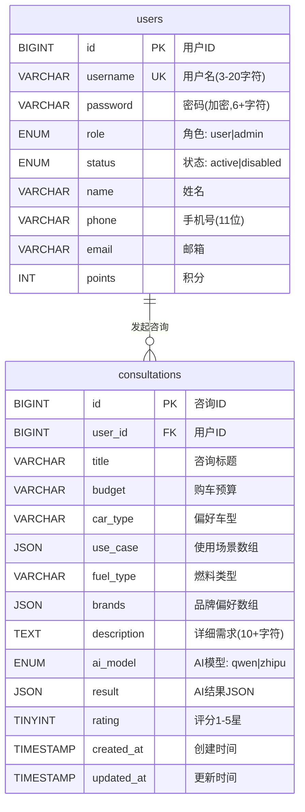
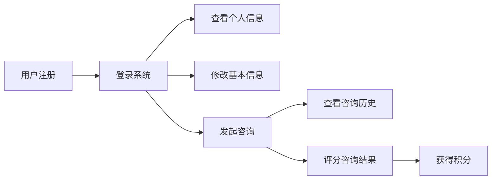
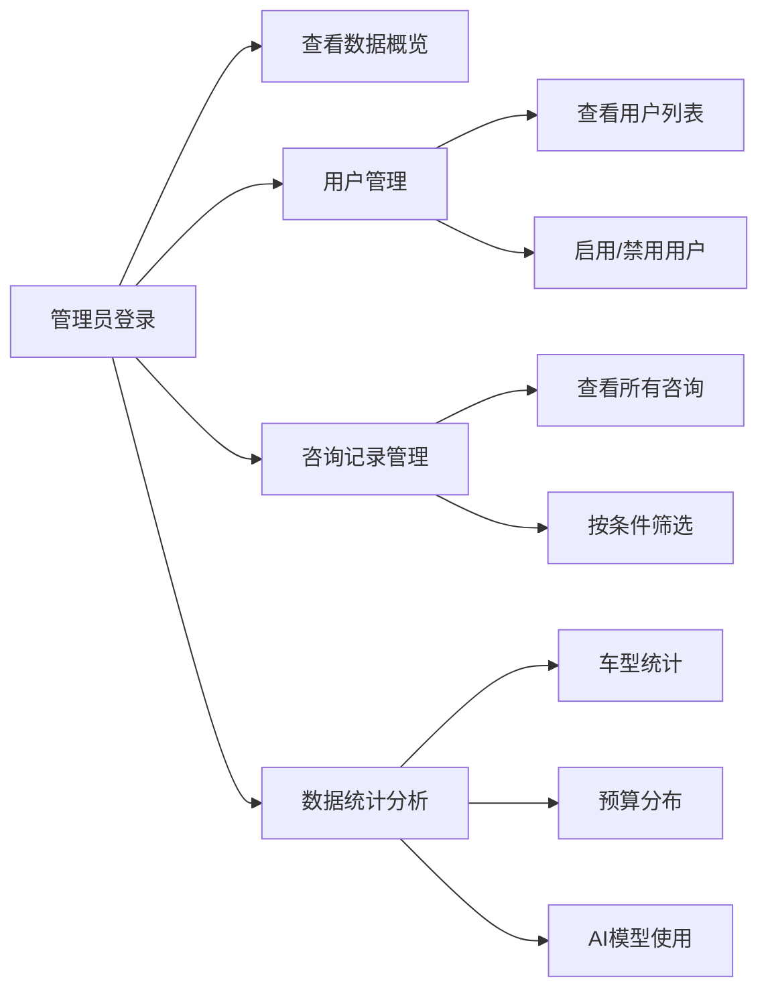
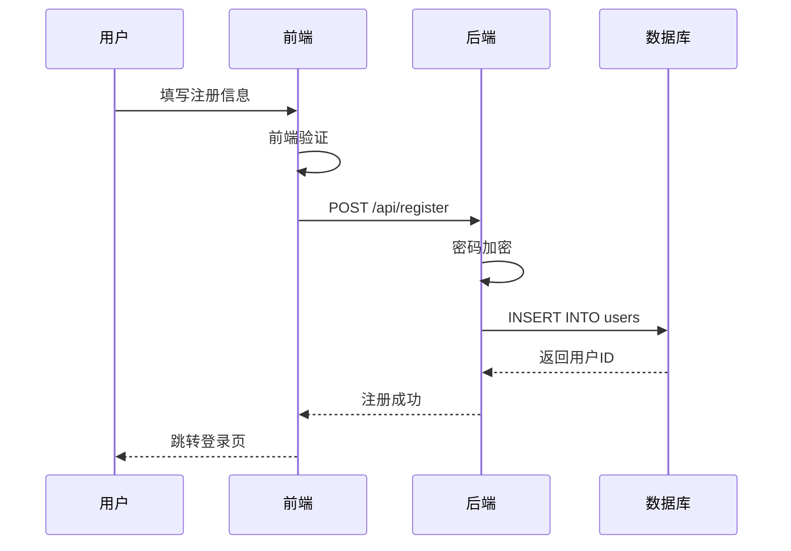
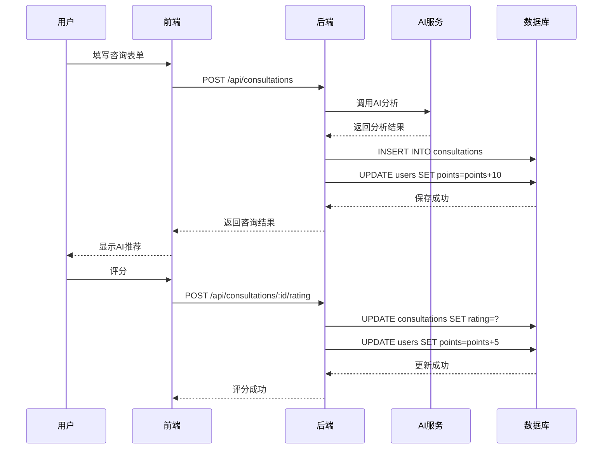
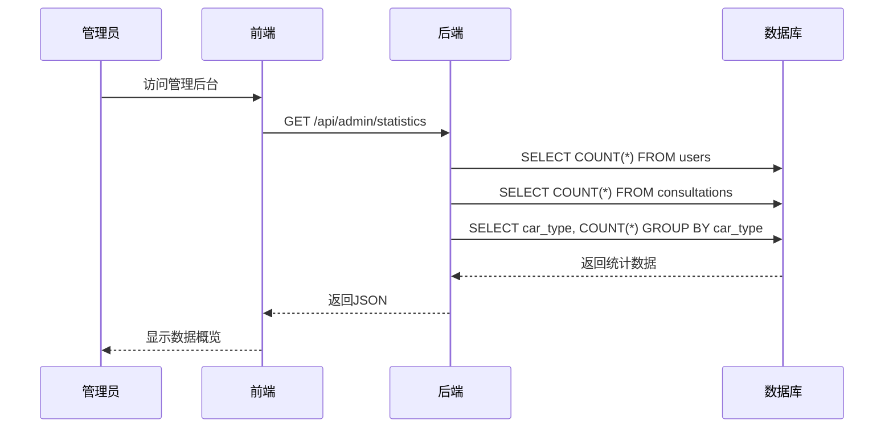

# 智能购车咨询系统 - ER图（精简版）

## 实体关系图



---

## 关系说明

### 主要关系

| 关系 | 类型 | 说明 |
|-----|------|------|
| users → consultations | 1:N | 一个用户可以发起多次咨询 |

### 外键约束

```sql
consultations.user_id → users.id (ON DELETE CASCADE)
```

**说明**：删除用户时，其所有咨询记录也会被自动删除。

---

## 角色功能划分

### 👤 普通用户 (role='user')



**使用的表和字段**：

**users表**：
- 基本信息：`username`, `password`, `name`, `phone`, `email`
- 积分管理：`points`

**consultations表**：
- 创建咨询：所有字段
- 查看自己的咨询：`WHERE user_id = ?`

---

### 👨‍💼 管理员 (role='admin')



**使用的表和字段**：

**users表**：
- 查看所有用户（`role='user'`）
- 管理状态：`status`（启用/禁用）
- 统计字段：`COUNT(*)`

**consultations表**：
- 查看所有咨询记录
- 统计维度：`car_type`, `budget`, `ai_model`, `created_at`

---

## 枚举值定义

### users.role - 用户角色

```sql
ENUM('user', 'admin')
```

| 值 | 说明 | 使用场景 |
|----|------|---------|
| **user** | 普通用户 | 注册用户，默认角色 |
| **admin** | 管理员 | 系统管理，查看所有数据 |

---

### users.status - 账号状态

```sql
ENUM('active', 'disabled')
```

| 值 | 说明 | 前端显示 |
|----|------|---------|
| **active** | 正常 | 绿色"正常"标签 |
| **disabled** | 禁用 | 红色"禁用"标签 |

---

### budget - 购车预算

**字段**：`consultations.budget`

```
'10万以下' | '10-20万' | '20-30万' | '30-50万' | '50万以上'
```

**前端下拉选项**：
- 10万以下
- 10-20万
- 20-30万
- 30-50万
- 50万以上

---

### car_type - 车型

**字段**：`consultations.car_type`

```
'SUV' | '轿车' | 'MPV' | '跑车' | '越野车'
```

**前端下拉选项**：
- SUV
- 轿车
- MPV
- 跑车
- 越野车

---

### fuel_type - 燃料类型

**字段**：`consultations.fuel_type`

```
'燃油' | '电动' | '混动' | '不限'
```

**前端下拉选项**：
- 燃油
- 电动
- 混动
- 不限

---

### use_case - 使用场景（JSON数组）

**字段**：`consultations.use_case`

**数组元素值**：
```
'通勤' | '家庭' | '商务' | '越野' | '其他'
```

**JSON示例**：
```json
["通勤", "家庭"]
```

**前端多选框**：
- ☐ 通勤
- ☐ 家庭
- ☐ 商务
- ☐ 越野
- ☐ 其他

---

### brands - 品牌偏好（JSON数组）

**字段**：`consultations.brands`

**数组元素值**：
```
'大众' | '丰田' | '本田' | '比亚迪' | '特斯拉' | '宝马' | '奔驰' | '奥迪'
```

**JSON示例**：
```json
["大众", "丰田", "比亚迪"]
```

**前端多选框**：
- ☐ 大众
- ☐ 丰田
- ☐ 本田
- ☐ 比亚迪
- ☐ 特斯拉
- ☐ 宝马
- ☐ 奔驰
- ☐ 奥迪

---

### consultations.ai_model - AI模型

```sql
ENUM('qwen', 'zhipu')
```

| 值 | 说明 | 前端显示 |
|----|------|---------|
| **qwen** | 通义千问 | 通义千问 |
| **zhipu** | 智谱AI | 智谱AI |

---

### consultations.rating - 评分

```sql
TINYINT (1-5)
```

| 值 | 说明 | 前端显示 |
|----|------|---------|
| **1** | 很差 | ★☆☆☆☆ |
| **2** | 差 | ★★☆☆☆ |
| **3** | 一般 | ★★★☆☆ |
| **4** | 满意 | ★★★★☆ |
| **5** | 非常满意 | ★★★★★ |

---

## JSON字段格式

### users.use_case / consultations.use_case

```json
["通勤", "家庭"]
```

**类型**：字符串数组  
**验证**：至少包含1个元素

---

### consultations.brands

```json
["大众", "丰田", "比亚迪"]
```

**类型**：字符串数组  
**验证**：可以为空数组

---

### consultations.result

```json
{
  "recommendation": "推荐车型：\n1. 比亚迪宋PLUS DM-i\n2. 丰田威兰达双擎",
  "analysis": "基于您的家庭需求和预算，推荐混动SUV性价比高，空间充足适合家庭使用。",
  "budgetAdvice": "建议预算控制在15-18万，可获得较好的配置和品质。"
}
```

**类型**：对象  
**字段**：
- `recommendation`：推荐车型信息
- `analysis`：详细分析
- `budgetAdvice`：预算建议

---

## 数据流程图

### 用户注册流程



---

### 咨询流程



---

### 管理员查看统计



---

## 索引策略

### 主键索引

```sql
-- 所有表
PRIMARY KEY (id)
```

### 唯一索引

```sql
-- users表
UNIQUE KEY idx_username (username)
```

### 业务索引

```sql
-- users表
INDEX idx_role (role)           -- 角色筛选
INDEX idx_status (status)       -- 状态筛选
INDEX idx_created_at (created_at)  -- 时间排序

-- consultations表
INDEX idx_user_id (user_id)     -- 用户咨询列表
INDEX idx_ai_model (ai_model)   -- AI模型统计
INDEX idx_car_type (car_type)   -- 车型统计
INDEX idx_created_at (created_at)  -- 时间排序
```

---

## 数据库特性

### 外键级联删除

```sql
FOREIGN KEY (user_id) REFERENCES users(id) ON DELETE CASCADE
```

**效果**：删除用户时，自动删除其所有咨询记录。

---

### 时间戳自动更新

```sql
created_at TIMESTAMP DEFAULT CURRENT_TIMESTAMP
updated_at TIMESTAMP DEFAULT CURRENT_TIMESTAMP ON UPDATE CURRENT_TIMESTAMP
```

**效果**：
- `created_at`：插入时自动设置
- `updated_at`：更新时自动更新

---

### 字符集

```sql
DEFAULT CHARSET=utf8mb4 COLLATE=utf8mb4_unicode_ci
```

**效果**：支持完整的Unicode字符，包括emoji表情。

---

## 查询示例

### 用户功能

#### 获取用户信息
```sql
SELECT id, username, role, name, phone, email, 
       budget, preferred_type, use_case, fuel_type, points
FROM users
WHERE username = ? AND password = ?;
```

#### 获取我的咨询列表
```sql
SELECT * FROM consultations
WHERE user_id = ?
ORDER BY created_at DESC;
```

#### 创建咨询
```sql
INSERT INTO consultations 
(user_id, title, budget, car_type, use_case, fuel_type, brands, description, ai_model, result)
VALUES (?, ?, ?, ?, ?, ?, ?, ?, ?, ?);
```

#### 评分咨询
```sql
UPDATE consultations 
SET rating = ? 
WHERE id = ? AND user_id = ?;
```

---

### 管理员功能

#### 获取所有用户
```sql
SELECT u.id, u.username, u.name, u.phone, u.email, u.points, u.status, u.created_at,
       (SELECT COUNT(*) FROM consultations WHERE user_id = u.id) as consultCount
FROM users u
WHERE u.role = 'user'
ORDER BY u.created_at DESC;
```

#### 启用/禁用用户
```sql
UPDATE users 
SET status = ? 
WHERE id = ? AND role = 'user';
```

#### 获取所有咨询
```sql
SELECT c.*, u.username, u.name
FROM consultations c
LEFT JOIN users u ON c.user_id = u.id
ORDER BY c.created_at DESC;
```

#### 数据统计 - 车型分布
```sql
SELECT car_type, COUNT(*) as count
FROM consultations
GROUP BY car_type
ORDER BY count DESC;
```

#### 数据统计 - 预算分布
```sql
SELECT budget, COUNT(*) as count
FROM consultations
GROUP BY budget
ORDER BY count DESC;
```

#### 数据统计 - AI模型使用
```sql
SELECT ai_model, COUNT(*) as count, AVG(rating) as avg_rating
FROM consultations
WHERE rating IS NOT NULL
GROUP BY ai_model;
```

---

## 性能建议

### 分页查询
```sql
-- 用户咨询列表分页
SELECT * FROM consultations
WHERE user_id = ?
ORDER BY created_at DESC
LIMIT 10 OFFSET 0;

-- 管理员用户列表分页
SELECT * FROM users
WHERE role = 'user'
ORDER BY created_at DESC
LIMIT 20 OFFSET 0;
```

### 使用索引
```sql
-- ✅ 使用索引
SELECT * FROM consultations WHERE user_id = 123;  -- 使用 idx_user_id

-- ✅ 使用索引
SELECT * FROM users WHERE role = 'user' AND status = 'active';  -- 使用 idx_role, idx_status
```

### 避免全表扫描
```sql
-- ❌ 避免
SELECT * FROM consultations WHERE description LIKE '%SUV%';

-- ✅ 推荐
SELECT * FROM consultations WHERE car_type = 'SUV';
```

---

**版本**：v2.0（精简版）  
**最后更新**：2024-11-11
